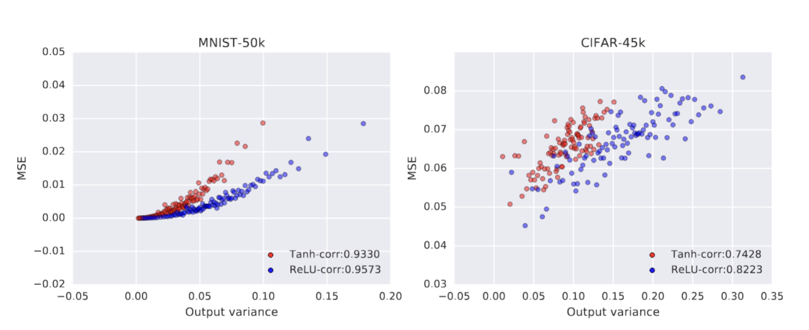

# Project 2: Reproducing Results from "Deep Neural Networks as Gaussian Processes"

Link to [github repo](https://github.com/sofieappel/NNGP_Project2).

## Reproducing Uncertainty Plots

This project aims to reproduce the uncertainty results of the paper, "Deep Neural Networks as Gaussian Processes," as well as 
extend the results to an additional data set. 

The paper argues that an infinitely wide neural network becomes a Gaussian Process (GP) which means all predictions come with uncertainty estimates. 
Figure 3 of the paper shows the high correlation of uncertainty with prediction error with training sets of size 50k for MNIST and 45k for CIFAR-10. 
To keep computational costs low, Figure 3 was reproduced using a training set of size 1k, depth of 3, weight variance of 2, and bias variance of 0.2. 
Both tanh and ReLU nonlinearities were applied like in the original paper. Points were binned by predicted variance and averaged over 100 test points.



*Figure 1: Original uncertainty results from Lee et al.*

<p float="left">
       
       
</p>

*Figure 2: Reproduced results using training set = 1000.*

The smaller training set does lead to differences in the correlation coefficient of uncertainty and prediction error, but still shows a similar positive trend 
that the larger training sets show. 

## Extending Results to Additional Dataset

The original paper uses the MNIST and CIFAR-10 image datasets. This extension uses the Fashion-MNIST dataset, a dataset that contains the same number of images and same resolution, 28x28 pixels, as MNIST but the images are of clothing rather than handwritten numbers. Both datasets are in grayscale. This addition to the results of 
the original paper can help test the effectiveness of the model on a similar yet somewhat more complex dataset. 

<p float="left">
       
       
       
</p>

*Figure 3: Fashion-MNIST, MNIST, CIFAR-10 at N=1000.*

The MNIST dataset produces the best correlation between uncertainty and prediction error, Fashion-MNIST is second best, and CIFAR-10 has the worst. This is to be expected because 
CIFAR-10 has much more variation within each class and the objects are not centered in the images like they are in the MNIST datasets.

| Dataset | Correlation (nonlinearity = tanh) |Correlation (nonlinearity = relu) |
| ------- | ----- | ------ |
| MNIST | 0.9815 | 0.9778 |
| Fashion-MNIST | 0.8838 | 0.8800 |
| CIFAR-10| 0.8053 | 0.6077 |

## Limitations

Results use 1,000 training and 1,000 evaluation points, far fewer than the paper's 50k/45k, so absolute values are not comparable to the original.
Each plotted series has only 10 binned points and results come from a single seed, so small differences between datasets may not be meaningful. Hyperparameters were fixed to the paper's Figure 3 settings and not tuned per dataset. CIFAR-10 uses a slightly different preprocessing pipeline from MNIST and Fashion-MNIST. Fashion-MNIST is close to MNIST in size and format, so agreement is modest evidence that the trend generalizes.


Commands to run:

```bash

cd /tmp
git clone https://github.com/sofieappel/nngp_project2.git
cd nngp_project2
docker build -t nngp-project .
docker run nngp-project

```


# NNGP: Deep Neural Network Kernel for Gaussian Process

TensorFlow open source implementation of

[**Deep Neural Networks as Gaussian Processes**](https://arxiv.org/abs/1711.00165)


by Jaehoon Lee*, Yasaman Bahri*, Roman Novak, Sam Schoenholz, Jeffrey Pennington,
Jascha Sohl-dickstein

Presented at the International Conference on Learning Representation(ICLR) 2018.

## UPDATE (September 2020):
See also [Neural Tangents: Fast and Easy Infinite Neural Networks in Python](https://arxiv.org/abs/1912.02803) (ICLR 2020)
available at [github.com/google/neural-tangents](https://github.com/google/neural-tangents) for 
more up-to-date progress on computing NNGP as well as NT kernels supporting wide variety of architectural components.


## Overview
A deep neural network with i.i.d. priors over its parameters is equivalent to a 
Gaussian process in the limit of infinite network width. The Neural Network
Gaussian Process (NNGP) is fully described by a covariance kernel determined by 
corresponding architecture.

This code constructs covariance kernel for the Gaussian process that is equivalent to
infinitely wide, fully connected, deep neural networks. 

## Usage

To use the code, run `run_experiments.py`,
which uses NNGP kernel to make full Bayesian prediction on the MNIST dataset.


```python
python run_experiments.py \
       --num_train=100 \
       --num_eval=10000 \
       --hparams='nonlinearity=relu,depth=100,weight_var=1.79,bias_var=0.83' \
```

## Contact
***Code author:*** Jaehoon Lee, Yasaman Bahri, Roman Novak

***Pull requests and issues:*** @jaehlee

## Citation
If you use this code, please cite our paper:
```
  @article{
    lee2018deep,
    title={Deep Neural Networks as Gaussian Processes},
    author={Jaehoon Lee, Yasaman Bahri, Roman Novak, Sam Schoenholz, Jeffrey Pennington, Jascha Sohl-dickstein},
    journal={International Conference on Learning Representations},
    year={2018},
    url={https://openreview.net/forum?id=B1EA-M-0Z},
  }
```

## Note

This is not an official Google product.
