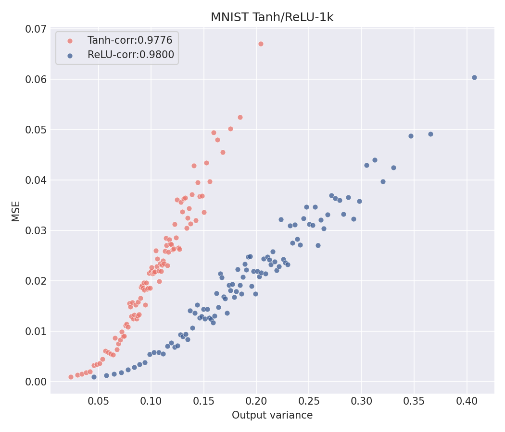
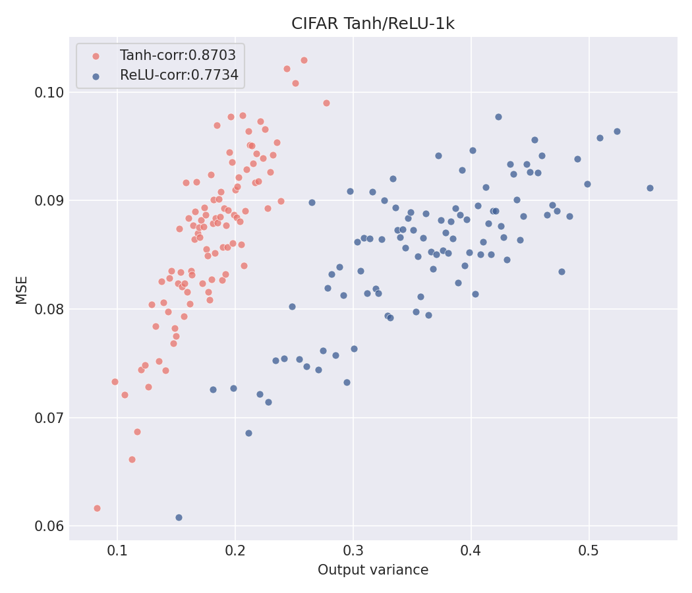
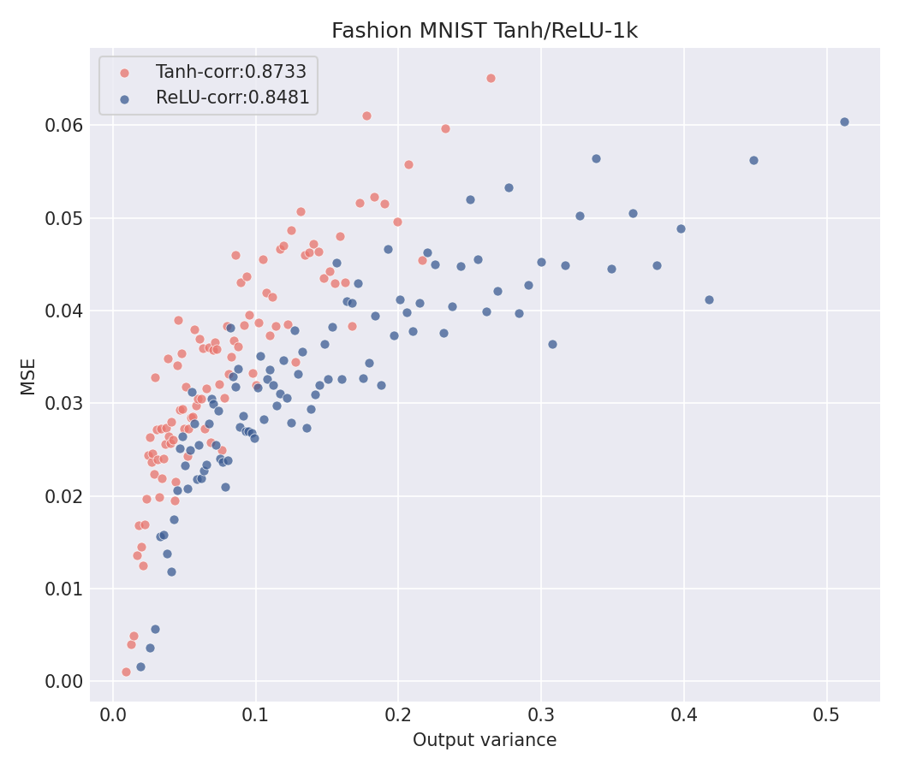

# Project 2: Reproducing Results from "Deep Neural Networks as Gaussian Processes"

Link to [github repo](https://github.com/sofieappel/NNGP_Project2).

## Reproducing Figure 3

This project aims to reproduce the uncertainty results of the paper, "Deep Neural Networks as Gaussian Processes," as well as 
extend the results to an additional data set. 

The paper argues that an infinitely wide neural network becomes a Gaussian Process (GP) which provides that all predictions come with uncertainty estimates. 
Figure 3 of the paper shows the high correlation of uncertainty with prediction error with training sets of size 50k for MNIST and 45k for CIFAR-10. 
To keep computational costs low, Figure 3 was reproduced using a training set of size 1k. All other parameters were set to a depth of 3, weight variance of 2, and bias variance of 0.2. 
Both tanh and ReLU nonlinearities were applied like in the original paper. 

<p align="center"></p>

<p align="center"><i>Figure 1: Original uncertainty results from Lee et al.</i></p>

<p align="center">
       
       
</p>

<p align="center"><i>Figure 2: Reproduced results using training set N = 1000.</i></p>

The correlation coefficients slightly differ from the paper, but still show evidence of a strong, positive relationship between uncertainty estimates and prediction error.

## Extending Results to Additional Dataset

Figure 3 of Lee et al. shows that the NNGP's predicted variance is strongly correlated with its actual error, but only for MNIST and CIFAR-10. To test whether this relationship is specific to those datasets, the experiment was repeated on the Fashion-MNIST dataset. This dataset matches MNIST in size, resolution (28x28 grayscale), and number of classes (10), so it runs through the same kernel code, preprocessing, and hyperparameters with only the data changed. It is also harder to classify, since several clothing classes look alike, which gives the uncertainty-error relationship a tougher test. 

All three datasets use the settings from the paper's Figure 3 caption: depth 3, weight variance 2.0, bias variance 0.2, with tanh and ReLU nonlinearities. Each model is trained on 1,000 examples and evaluated on 10,000 test points, which are sorted by predicted variance and averaged in bins of 100, giving 100 plotted points per series. Each result comes from a single run. 

<p float="left">
       
       
       
</p>

<p align="center"><i>Figure 3: Predicted variance vs. MSE for Fashion-MNIST, MNIST, CIFAR-10 at N=1000.</i></p>
  

| Dataset | Correlation (nonlinearity = tanh) |Correlation (nonlinearity = relu) |
| ------- | ----- | ------ |
| MNIST | 0.9776 | 0.9800 |
| Fashion-MNIST | 0.8733 | 0.8481 |
| CIFAR-10| 0.8703 | 0.7734 |

Fashion-MNIST keeps a strong positive correlation (0.87 for tanh, 0.85 for ReLU). This is lower than MNIST (about 0.98) and comparable to CIFAR-10 (0.87 for tanh, 0.77 for ReLU). MNIST is clearly highest, while Fashion-MNIST and CIFAR-10 are indistinguishable under tanh and Fashion-MNIST higher under ReLU. Therefore, a strict ranking between the two datasets cannot be claimed. These results do support that the relationship is not specific to MNIST and CIFAR-10, and that is weakens on the harder tasks.


## Limitations

To decrease time and computational costs, these results used 1,000 training points versus the paper's 50,000 and 45,000. Additionally, the Fashion-MNIST dataset is close to MNIST in format, so similar results give modest evidence that the trend generalizes. The results are also from a single run, with the same hyperparameters as the paper rather than tuned per dataset.

## Reproduce the Result

Run these commands:

```bash

git clone https://github.com/sofieappel/nngp_project2.git
cd nngp_project2
mkdir -p output
docker build -t nngp-project .
docker run -v "$(pwd)/output":/nngp/output nngp-project

```

The original paper's Github can be found [here](https://github.com/brain-research/nngp).

## References

Lee, J., Bahri, Y., Novak, R., Schoenholz, S. S., Pennington, J., & Sohl-Dickstein, J. (2018). Deep neural networks as Gaussian processes. *International Conference on Learning Representations*. https://openreview.net/forum?id=B1EA-M-0Z

Xiao, H., Rasul, K., Vollgraf, R. (2017). Fashion-MNIST: a Novel Image Dataset for Benchmarking Machine Learning Algorithms. *arXiv*. https://arxiv.org/abs/1708.07747

